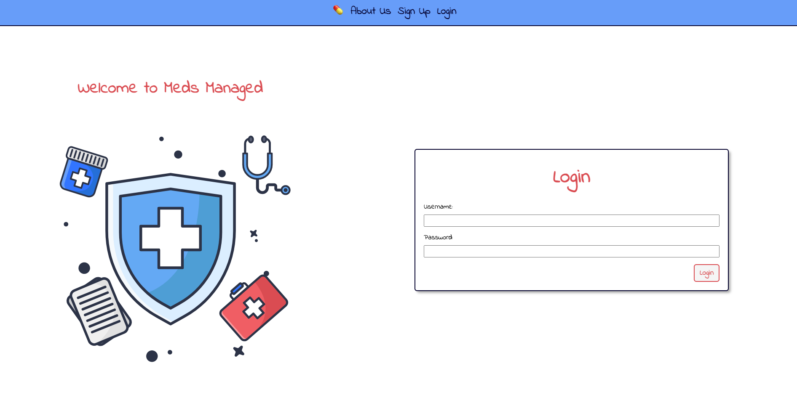
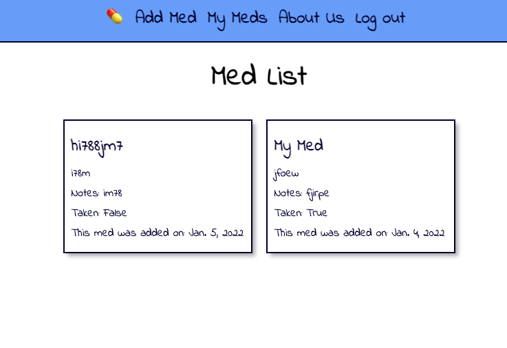

# **Meds Managed** 
----

### Created by Darby Benfield [LinkedIn](https://www.linkedin.com/in/darby-benfield/)

&nbsp;

## Check out _[Meds Managed](https://invibe-tipsy-t.herokuapp.com/)_ here!

  

&nbsp;

## About Meds Managed

I created Meds Managed as a tool to help patients track their medications. 

I wanted the interface to be extremely simple and easy to navigate, particularly for patients that have memory impairments or other disorders. 

As a family practice RN (nurse) I frequently created simple Microsoft word tables that I would print for patients, for them to be used to track and check off their daily medications. Meds Managed is the upgraded version of this idea, using Python and Django. 

[Trello](https://trello.com/b/NPInOIjb/meds-managed) was an invaluable resource for planning and organization. 

&nbsp;

## Site:

&nbsp;

&nbsp;

## Future Goals:
  1. Add feature to check off medications as they have been taken for that day. 
  2. Organize meds by how they are taken, i.e. morning, noon, night. 
  3. Add feature to add pharmacy information for easy refills, questions, etc. 
  4. Add API or link to UPTODATE or DRUGS.com for additional medication info. 
  5. Set up a reminder feature to send push notification reminders. 
   

&nbsp;

## Credits/ Invaluable Resources:
1. Ben Manley and Jurgen Stevens 
2. David Stinson (CSS styling)
3. lottiefiles.com
  

&nbsp;

## Technology Used:

